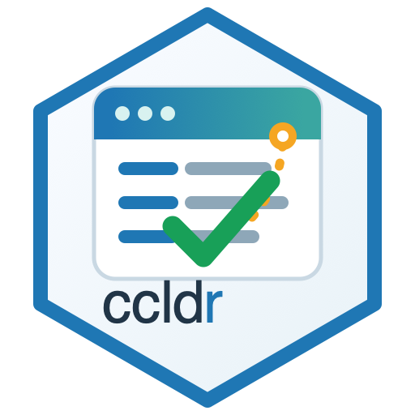

# ccldr



`ccldr` is a small R client for the [California Community Care Licensing
Division (CCLD) Transparency
API](https://www.ccld.dss.ca.gov/carefacilitysearch/).

Use it when you need to:

- verify CCLD child-care facility license numbers from an R script;
- fetch the full detail record for a single facility;
- pull a live Alameda County child-care facility snapshot by facility
  type;
- append Census geographies to facility rows that have addresses.

The package returns tibbles, keeps unknown licenses in your output, and
caches API responses on disk so repeated development runs are gentler on
the upstream service.

## Installation

``` r

# install.packages("pak")
pak::pak("chekos/ccldr")
```

You can also install with `remotes`:

``` r

remotes::install_github("chekos/ccldr")
```

## Quickstart

``` r

library(ccldr)
library(dplyr)
library(readr)

# Verify a column of license numbers without dropping unknown inputs.
# ccld_verify() accepts 8- or 9-digit license numbers and pads internally.
rr <- read_csv("rr_sites_2026.csv")

verified <- ccld_verify(rr$license_number)

rr |>
  left_join(verified, by = c("license_number" = "input")) |>
  select(site_name, license_number, found, facility_name, status, capacity)
```

Example output:

``` text
#> # A tibble: 2 x 6
#>   site_name                 license_number found facility_name       status   capacity
#>   <chr>                     <chr>          <lgl> <chr>               <chr>       <int>
#> 1 Johnson Family Child Care 13423996       TRUE  JOHNSON III, JOHNNY Licensed       14
#> 2 Unknown Site              99999999       FALSE <NA>                <NA>          NA
```

Pull one full facility record when you need visits, complaint counts,
reports, or itemized complaints.
[`ccld_facility()`](https://chekos.github.io/ccldr/reference/ccld_facility.md)
also accepts either the 8- or 9-digit form:

``` r

facility <- ccld_facility("13423996")

facility |>
  select(facility_name, status, capacity, last_visit_date)
```

Example output:

``` text
#> # A tibble: 1 x 4
#>   facility_name       status   capacity last_visit_date
#>   <chr>               <chr>       <int> <date>
#> 1 JOHNSON III, JOHNNY Licensed       14 2024-11-04
```

``` r

facility |>
  tidyr::unnest(reports) |>
  select(facility_number, report_date, report_type)
```

Example output:

``` text
#> # A tibble: 1 x 3
#>   facility_number report_date report_type
#>   <chr>           <date>      <chr>
#> 1 013423996       2024-11-04  Other
```

[`ccld_verify()`](https://chekos.github.io/ccldr/reference/ccld_verify.md)
includes `capacity` and `date_closed`, which are useful when auditing
sites in bulk. Pull the full facility record when you need those fields
alongside richer detail:

``` r

ccld_facility("013423958") |>
  select(facility_number, facility_name, status, date_closed)
```

Build a current Alameda snapshot for a supported child-care facility
type:

``` r

preschools <- ccld_alameda("preschools")
large_fccs <- ccld_alameda("large_fccs")

preschools |>
  select(facility_number, facility_name, status, city, zip) |>
  slice_head(n = 3)
```

Example output:

``` text
#> # A tibble: 3 x 5
#>   facility_number facility_name          status   city    zip
#>   <chr>           <chr>                  <chr>    <chr>   <chr>
#> 1 013423751       WILD CHILD SCHOOLHOUSE Licensed Oakland 94611
#> 2 013423056       AGAPE LEARNING CENTER  Licensed Oakland 94621
#> 3 013422467       COLIBRI PRESCHOOL      Licensed Oakland 94611
```

Supported Alameda types are `"large_fccs"`, `"infant_centers"`,
`"school_age_centers"`, `"preschools"`, and `"single_licensed_centers"`.

Append Census geography codes when you need tract, block, ZCTA, school
district, or other geography fields for addressable facility rows. The
Census Geocoder does not require an API key, and `ccldr` caches repeated
address lookups.

``` r

preschools_geo <- preschools |>
  ccld_add_census_geographies()

preschools_geo |>
  select(facility_number, latitude, longitude, census_tract_geoid, zcta_geoid)
```

Example output:

``` text
#> # A tibble: 3 x 5
#>   facility_number latitude longitude census_tract_geoid zcta_geoid
#>   <chr>              <dbl>     <dbl> <chr>              <chr>
#> 1 013423751           37.8     -122. 06001401100        94611
#> 2 013423056           37.7     -122. 06001409400        94621
#> 3 013422467           37.8     -122. 06001401100        94611
```

## Live API behavior

`ccldr` talks to public APIs. For reproducible scripts, keep these
habits in mind:

- Use `cache = FALSE` when you need a fresh API response for a single
  call.
- Use
  [`ccld_cache_clear()`](https://chekos.github.io/ccldr/reference/ccld_cache_clear.md)
  before rerunning a full workflow from scratch.
- Use `options(ccldr.verbose = TRUE)` to print request paths while
  debugging.
- Use `options(ccldr.delay = 1)` to slow down batch requests.

[`ccld_alameda()`](https://chekos.github.io/ccldr/reference/ccld_alameda.md)
walks the 17 Alameda cities to avoid the API’s 250-result response cap.
If any city still hits that cap, the function warns that the snapshot
may be incomplete.

[`ccld_add_census_geographies()`](https://chekos.github.io/ccldr/reference/ccld_add_census_geographies.md)
calls the U.S. Census Geocoder once per distinct address, requests
`layers = "all"` by default, and keeps unmatched rows in the output with
`geocode_status` explaining what happened.

## Documentation

- Get started:
  [`vignette("ccldr")`](https://chekos.github.io/ccldr/articles/ccldr.md)
- Reference site: <https://chekos.github.io/ccldr/>
- Capacity audits:
  <https://chekos.github.io/ccldr/articles/capacity-audits.html>
- Capacity by geography:
  <https://chekos.github.io/ccldr/articles/capacity-geography-analysis.html>
- Closure date audits:
  <https://chekos.github.io/ccldr/articles/closure-date-audits.html>
- Live workflow guide:
  <https://chekos.github.io/ccldr/articles/live-api-workflows.html>
- Troubleshooting and FAQ:
  <https://chekos.github.io/ccldr/articles/troubleshooting.html>
- Design notes:
  [`docs/design.md`](https://chekos.github.io/ccldr/docs/design.md)

## Related

- [`chekos/ccld-open-data-snapshot`](https://github.com/chekos/ccld-open-data-snapshot)
  provides bulk CKAN snapshots of Alameda CCLD data and the Python
  `verify.py` companion. `ccldr` is the live, per-facility-detail R
  layer.
